Perhaps you've heard the whispers amongst the marketing team. Or perhaps you've heard the words spill from the mouth of a product manager in sheer terror. Maybe you have even seen sites that crop up occasionally on ProductHunt regarding it. The most controversial, feared, yet most in-demand two words in the English language:

*Design system.*

Chances are if you're reading this, you already know what one is, or at the very least have heard the term before. Yet in the off-chance you don't: put simply, a design system (sometimes referred to as a design language) is the building blocks that construct a product's visual appearance, which often translates to a crisp implementation of a product's brand.

For a quick example, we can turn to Google, one of the leaders in brand development:

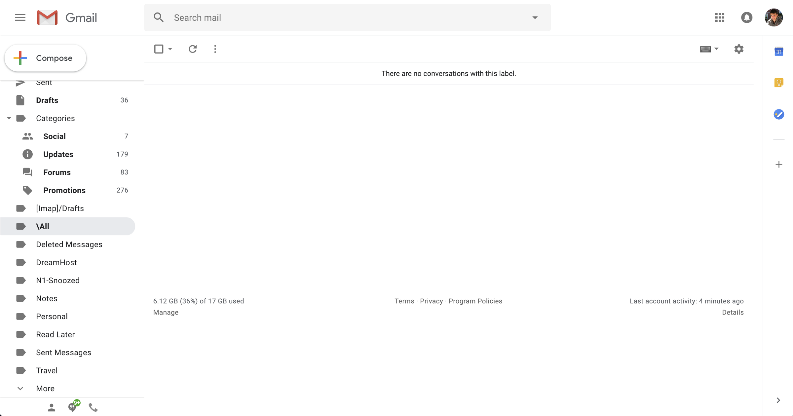

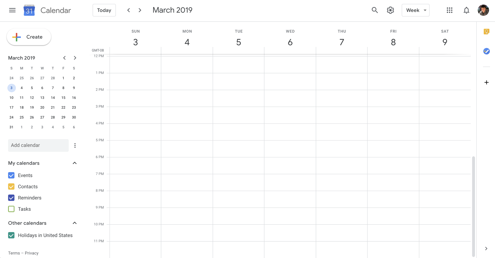

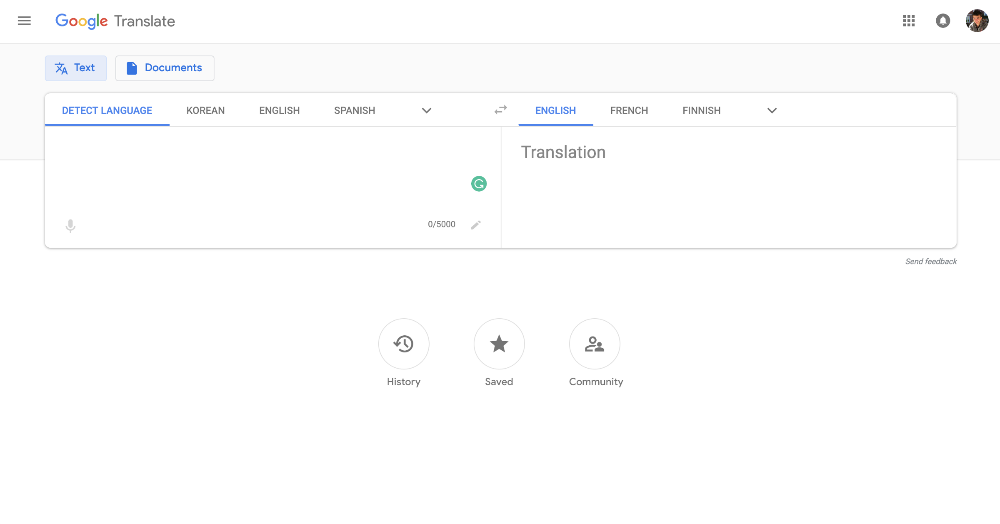

Above are three Google products: Mail, Calendar, and Translate. Notice the continuity between the three. Mail and Calendar both share a prominent white (yet colorful) "call-to-action" button, as well as the same style of TextBox. Calendar and Translate share the same style of a flat, navigation action button.

All three are completely independent products: they all live on different domains and are usually used completely independently of one another. Yet overlooking the "Google" logo, you can still tell its a Google product.

While design systems are most commonly associated with design teams, they don't have to be. There are simple metrics and principles you can apply to your own work to help unify your frontend design and improve its overall brand and consistency.

In this article, we'll be talking about general guidelines and steps you can follow to begin building and enforcing a design language of your own. It can be quite the rabbit hole, so we'll keep it high level and I'll provide links to additional resources you can reference as well.

## Anatomy of a design system

Before diving in, it is important to first understand the anatomy of the typical design system. Perhaps you've heard the term "atomic design" before. Atomic design is a metaphor devised by web developer Brad Frost to describe the hierarchy of components in a design system:

1. **Atoms —** denote the most primitive building blocks of a UI (such as buttons and text fields)
2. **Molecules —** denote compound elements on a page (such as forms)
2. **Organisms —** denote sections or chunks of a page (such as a footer or navbar)
3. **Templates —** denote reusable pages that contain dynamic data (such as a profile page)
4. **Pages —** denote a specific implementation of a template (such as a specific user profile page)

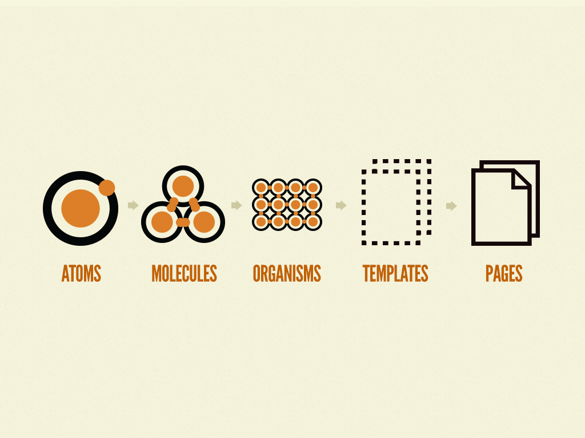

The majority of design systems focus primarily on atoms and molecules, while sometimes containing organisms such as headers, footers, and side navigation. Template and page implementations are typically left up to the consumers of the design system to implement (i.e. frontend developers).

That said, transcending the notion of web design, in general, design systems can be represented by the following hierarchy:

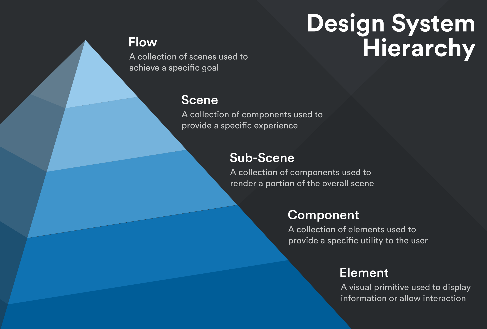

In the sections below, we'll be honing in mainly on developing and refining atoms, or design elements, with which you can begin building a design language.

### Getting started

The secret to building a comprehensive design language really boils down to just one word: generalization. The less specific your components are, the more reusable and the more "adoptable" the system becomes.

In fact, to a certain degree, the world of design may be one of the few contexts in which its stereotyping is encouraged. For example:

> Should I assume that every single red button on this site performs a destructive operation?

Hell. Yes.

Could you imagine how frustrating it would be if a "Delete File" button radically changed its color depending on where you viewed it on a website? There's basically a 99% guarantee you would accidentally irreversibly delete something.

Brands (and the design systems that power them) are built around consistency.

How can users assess a brand accurately if it's wildly inconsistent? How can they learn to trust it?

### Introspection

This brings us to our first step: introspection and visual auditing. Comb over the entirety of your user interface, and ask yourself this very important question:

> Which components can be consolidated? Do any two share the same purpose?

In a design language, each artifact should have a well-defined purpose and unique visual distinction from all other elements. If you have too many components used in the exact same way or that look nearly identical then you'll never know when to use one or the other (and believe it or not, people hate [making choices](https://www.nytimes.com/2010/02/27/your-money/27shortcuts.html)).

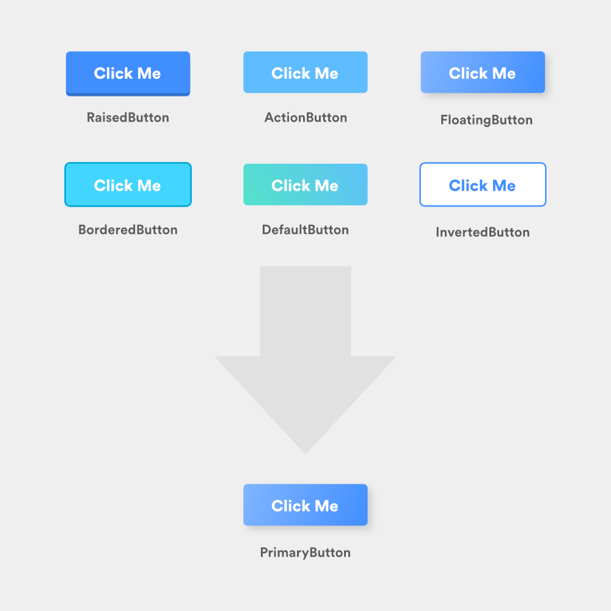

By the end of the audit, you want to make sure all remaining components and styles exist to serve a distinct purpose and convey an individual meaning.

To help guide us through these guidelines, we'll be improving the design system surrounding the following modal:

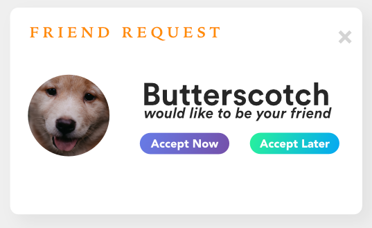

Looks like something off a spam site, doesn't it?

## Sizing, spacing & type

In the majority of all design systems, numeric multiples dictate the number of various font and padding sizes available within the UI. This means that as opposed to choosing whichever padding/margin/font-size you feel like using when building a component, you should choose from a set collection of "base" or intermediate sizes.

For example, if we were to define an 8pt sizing system, the base sizes would be 8px, 16px, 24px, 32px, etc. and might contain custom intermediate sizes of 12px, 14px, 16px, 20px, etc.

Intermediate sizes are usually multiples of two for easy divisibility and can be anything you choose, as long as they're visually unique. Overall, you should have no more than ten unique sizes across your entire design system ranging from tiny (e.g. 10px) to huge (e.g. 72px).

All sizes should be assigned human-readable names depending on the context in which they are used. Below we talk about two of these contexts: spacing and fonts.

### Spacing

Spacing labels can vary per component, and are usually similar to shirt sizes: xs, s, m, lg, xlg. These sizes should all be highly unique from one another so they create a strong visual distinction (e.g. don't have extra small (xs) be 11px and small (s) be 12px).

In general, smaller spaces should be used between elements of close relation ([Gestalt theory](https://uxplanet.org/gestalt-theory-for-ux-design-principle-of-proximity-e56b136d52d1)) while larger spaces can be used to improve the focus and increase the readability of certain elements (such as headers).

### Fonts

Font sizes should be labeled after their intended uses and be directly indicative of their size. A good example of consistent font sizing can be seen in the [typography section](https://www.carbondesignsystem.com/guidelines/typography/overview) of IBM's Carbon Design System.

Furthermore, all typography should not use more than two font families and should assign a designated weight to each font size for consistency. For example, all headers might be 32px with a font weight of 600, while body text might be 16px with a font weight of 400.

Mixing and matching weights and sizes randomly will lead to inconsistency across the UI and defeat the whole purpose of the design system.

### Example

Going back to our example with Butterscotch, we can consolidate and normalize our sizing, fonts, and types to drastically improve the structure of the modal and utilize our new design system:

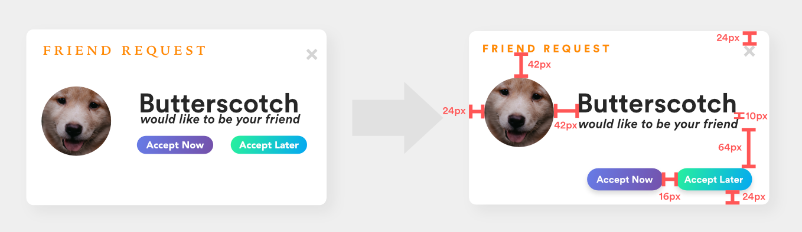

Notably:

1. The fonts are consolidated into a single font family
2. Font styles are re-evaluated to use a modal header (18pt, 900), header (46pt, 800), subheader (22pt, 800), and bold body (16pt, 700)
3. Buttons are grouped together, while the header is brought closer to the header image. The header and subheader were given 10pt breathing room
4. Card padding is now consistent

### Resources

1. [More Padding, Please!](https://medium.com/wayfair-design/more-padding-please-b95e19422acc)
2. [The Power of Empty Space in UI Design](https://uxplanet.org/https-medium-com-viktorija-bachvarova-the-power-of-empty-space-in-uidesign-14f14f8b203)
3. [Type Scale](https://type-scale.com/)

## Colors

The breakdown of colors within a brand is typically as follows:

1. **Primary:** _The_ brand color. The color most associated with your product, company, etc. Think "Facebook Blue" or "Spotify Green".
2. **Secondary:** An optional auxiliary color used to complement the primary color. For example, FedEx uses purple as a primary color and orange as a secondary.
3. **Grays:** Several distinct shades of gray used in body text as well as shadows, borders, dividers, and other structural components. Grays, whites, and blacks should make up most of your interface. More info on that [here](https://blog.logrocket.com/designing-as-a-developer-in-2018-eca1ab5bff2).
4. **Accents:** A variety of bright colors used to accent components such as cards and banners. Accents can also be used to convey specific meanings (e.g. red for danger/error, green for success, etc.). A good resource for finding soft primary colors to complement a brand [can be found here](http://www.flatuicolorpicker.com/).

There are typically light and dark versions of the primary and secondary colors to account for hover and depressed states, as well as maybe four to five accent colors.

In total, there are roughly 16 unique colors that the design system should be comprised of.

#### Example

Returning to Butterscotch, we can normalize our color palette by choosing a primary color (in this case purple), and applying grayscale to the rest of the UI. Given that "Accept Later" provides a secondary action, it should not be competing with the primary action button for attention.

Note the reuse of specific shades of gray, notably in the title bar of the modal.

#### Resources

1. [Color in UI Design: A (Practical) Framework](https://medium.com/@erikdkennedy/color-in-ui-design-a-practical-framework-e18cacd97f9e)
2. [Picking Colors](https://medium.com/hh-design/picking-colors-part-1-techniques-4d67b314781d)
3. [Color in Design System](https://medium.com/eightshapes-llc/color-in-design-systems-a1c80f65fa3)s

### Elevation

Presenting a well-defined dimensionality to your frontend is just as important as managing the composition of its elements. Modern websites often use light effects such as inner and outer drop shadows, as well as component layering, to build a visual hierarchy of elements on the page.

While this technique often renders fantastic UIs, overusing or consistently picking random values for drop shadows can create confusion and disrupt the flow of the page.

Your UI should not be an MC Escher puzzle. Look at the interface below and try to determine which element is on top. Is it the left nav? Why isn't there a top shadow? Is the nav attached to the navbar? If that's the case, why doesn't the top nav have a shadow too? How can the top nav be attached to both side navs and yet the side navs have different elevations?

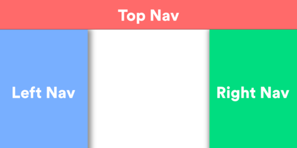

When constructing a design language, it is crucial to make the unique elevation levels of components clear. Google's Material Design library does an [excellent job](https://material.io/design/environment/elevation.html) of defining eight unique elevation levels and assigning elevation ranges to a specific component to ensure the hierarchy remains consistent.

According to Material Design, elevation serves three main purposes:

1.  Allow surfaces to move in front of and behind other surfaces, such as scrolling content behind a navigation bar
2.  Reflect spatial relationships and separate elements from one another
3.  Focus attention to the element with the highest elevation

Elevation can also be used to indicate focus in three-dimensional space. For example, Google utilizes elevation in material design to signify when a card is "picked up" (elevated focus) while Udacity utilizes elevation to depress buttons when hovered over (de-elevated focus).

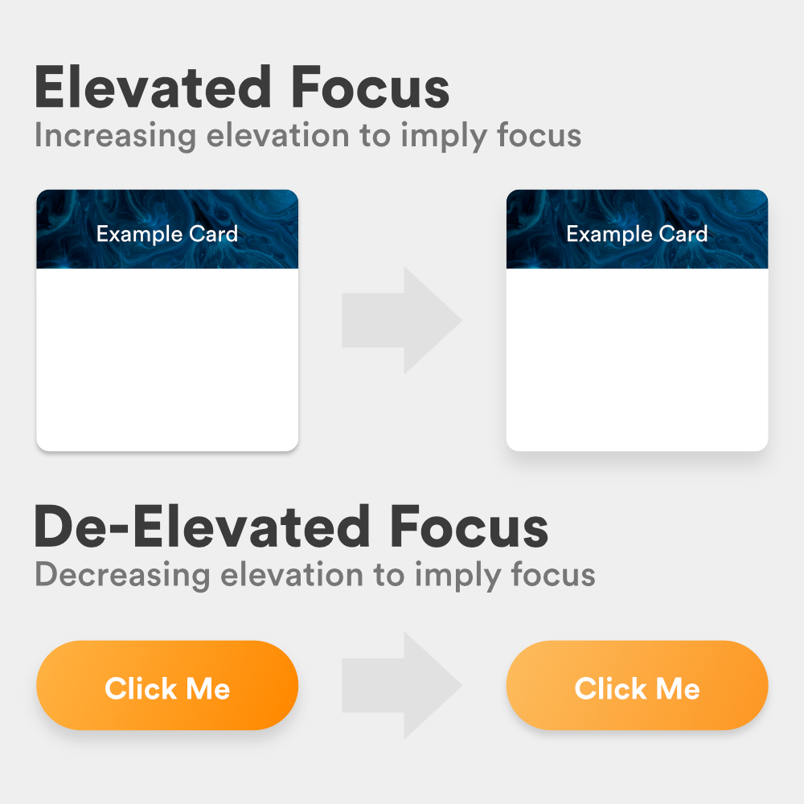

Important questions to ask when deciding on the elevation levels of your UI should be:

1. In each of my components, which elements overlap? Do the overlapping elements exist to serve the same *functional purpose* or does each element serve its own purpose? Should they be distinguished via one another?
2. Are my most important elements at the "forefront" of the screen when they are displayed?
3. How do my elements indicate various states? Does it make sense for states to appear in three or two-dimensional space?

### Example

Going back to Butterscotch, you'll notice so far everything within the modal has been flat. To present our action button as a physical object on the screen, we can utilize de-elevated focus to give it a sense of clickability:

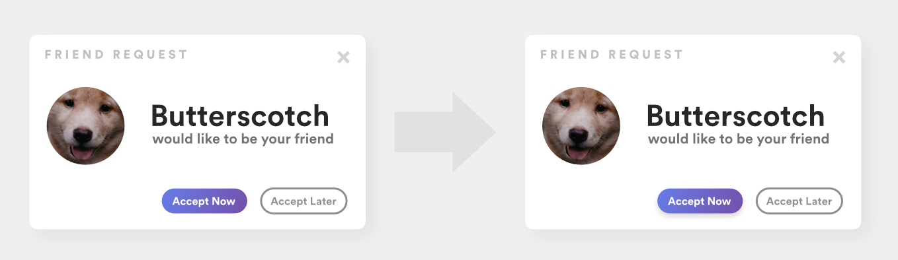

### Resources

1. [Graphical User Interface as a Reflection of the Real World: Shadows and Elevation](https://uxplanet.org/graphical-user-interface-as-a-reflection-of-the-real-world-shadows-and-elevation-f456530317f4)
2. [Material Design: Elevation](https://material.io/design/environment/elevation.html)
3. [How To Use Shadows And Blur Effects In Modern UI Design](https://www.smashingmagazine.com/2017/02/shadows-blur-effects-user-interface-design/)

### Conclusion

Overall, by applying the above guidelines of generalization and limitation to your UI, you can begin abstracting your design into a universal design system that can be adapted into React or Angular components, UIViews, etc.

Design systems are highly complex, highly discussed endeavors, and unfortunately, this article only begins to scratch the surface. As you continue to build your own design system, it is essential you continue researching to learn of the constantly evolving practices regarding them.

Now that our modal is better structured, we can run a final audit and determine which components, colors, fonts, and sizes our design system can consist of:

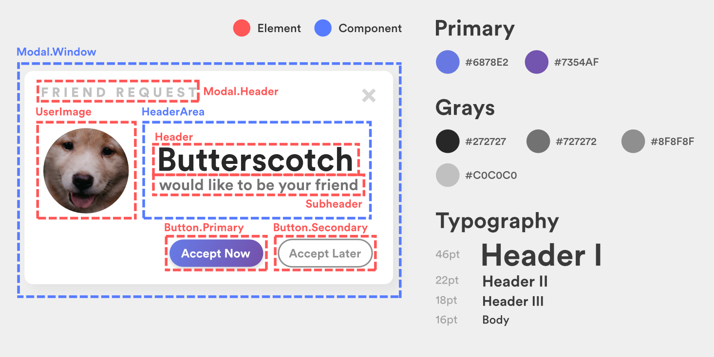

While our palette and typography may seem incomplete, keep in mind this was just an example of how to approach seeding a design system. When such analysis is run over an entire platform, a comprehensive system can be easily built.