Whether you’re building a product, a tool, a website, a service, or a startup: first impressions are everything. Users inherently gravitate towards products they can trust, products that feel legitimate and provide a sense of security. A website that looks like it was designed by a child always make users feel safe and sound. Even if your product is great, no one will use it if it looks like you don’t know what your doing.

Yet, as a developer, design can often feel like an uphill battle. Your number one goal is to ensure the software you’re building works, and that it works well. Most developers give little or no thought to the visual design of their work, and for most developers that’s okay.

But if you’re a frontend developer, design should be at the heart of everything you do. Not only do you need to implement the designs of others, but you really should be able to handle designing your own project.

So, how do you design your frontend in 2018?

That’s what I’ll cover here. Think of it as a comprehensive cheat sheet for the non-designer.

I’ll hit three primary design components:

- Color
- Light
- Typography

Each section is broken into a set of general rules to follow, an example, and a list of resources you can use.

## Semi-skeuomorphism

Before we dive into all the shortcuts you can take when designing a frontend in 2018, it’s important to understand the design principle we’ll be following: semi-skeuomorphism.

Sounds scary, but it really isn’t. In fact, you’re probably already highly familiar with the concept.

Skeuomorphism is a design principle where shadows, gradients, and textures are used to create elements representative of real-world elements. Texture and light are the two primary ingredients in skeuomorphic design, and from 2007–2013, they seemed to appear everywhere.

But first let’s get you grounded in the relevant design principles.

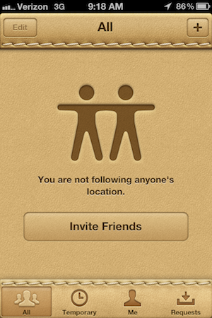

Much of this may have been attributed to Apple’s own interpretation of modern design language, as their 2011 User Interface Guidelines specify:

> When appropriate, add a realistic, physical dimension to your application. Often, the more true to life your application looks and behaves, the easier it is for people to understand how it works and the more they enjoy using it… often, an amplified or enhanced portrayal of something can seem more real, and convey more meaning, than a faithful likeness.

Yet by 2012, a slow migration had begun towards a much flatter design system. Driven by the emergence of design languages like [Metro UI](https://en.wikipedia.org/wiki/Metro_%28design_language%29) and [Material Design](https://en.wikipedia.org/wiki/Material_Design), flat design introduced softer and more uniform color palettes, thinner typefaces, and the use of shadows as tools of systematic hierarchy as opposed to the reinforcement of hyper-realism (referred to by Google as [“Elevation Hierarchy”](https://material.io/design/environment/elevation.html#elevation-hierarchy)).

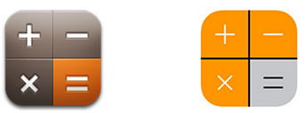

Alright, so what’s semi-skeuomorphism? Semiskeu is a design principle that combines the colorful gradients and use of shadows found in skeuomorphic design with many of the principles found in flat design.

You’re likely pretty familiar with this one too, as it’s pretty much everywhere. A great example of semiskeu in action is the [Stripe homepage](https://stripe.com):

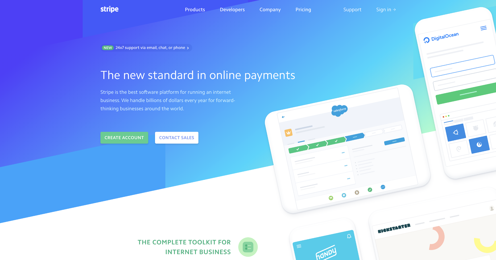

What do you notice?

1. Soft shadows add subtle dimension to the page’s flat device illustrations
2. The header gradient moves from dark to light, left to right, pulling your eyes towards the illustrations and creating an accent
3. Illustrations rest at an angle compared to the page copy to bring focus to them

In semiskeu, shadows and gradients are not only used to imply light, but are used to accent, amplify, or bring attention to notable elements on the page (points 1 & 2).

Additionally, while semiskeu maintains the geometric simplicity found in flat design, an increasing number of websites utilize unconventional shapes and curved divs in order to the page as a fluid entity, as opposed to a page divided into clear horizontal sections (3).

Now that we have some context, let’s start designing.

## Color

One of the most common mistakes frontend devs make when building websites is leaving subtlety out of their designs.

It’s 2018, not 2003. People can’t get away with shipping bright blue and green operating systems anymore. Websites no longer have dancing gifs or starry backgrounds.

Choose your color palette carefully.

### General Rules of Thumb

1. **The background of your site’s content should never be anything but a shade of gray.** Use white, light gray, or a dark gray.
2. **Only use colored or gradient backgrounds in sections designed to draw the user’s attention.** Think headers, heroes, call-to-action banners, etc.
3. **In most cases, use white text on any image, colored, or gradient background.** Additionally, a light drop shadow can sometimes help promote the text’s prominence.
4. **Never use absolute blacks.** Pure, opaque black (#000) is often too harsh for most webpages. Even this article has its font color set to an opacity of 84%.
5. **Ensure colored components do not border each other.** Unless the colors are very strong compliments of one another, often times the contrast of two neighboring colors can create a sense of polarization and division that breaks the flow of your page. If a navigation bar might touch a colored hero, opt for a transparent navbar background instead.

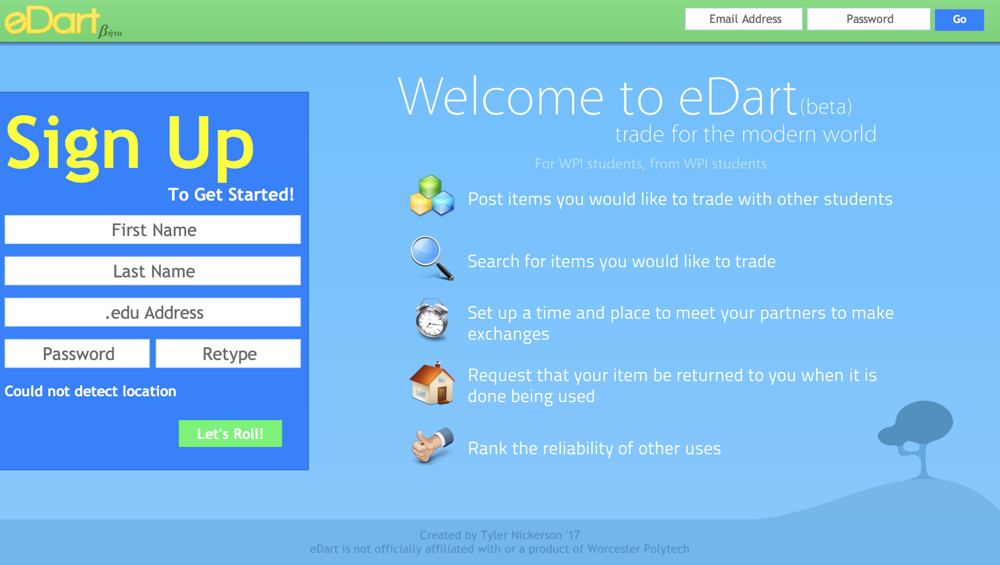

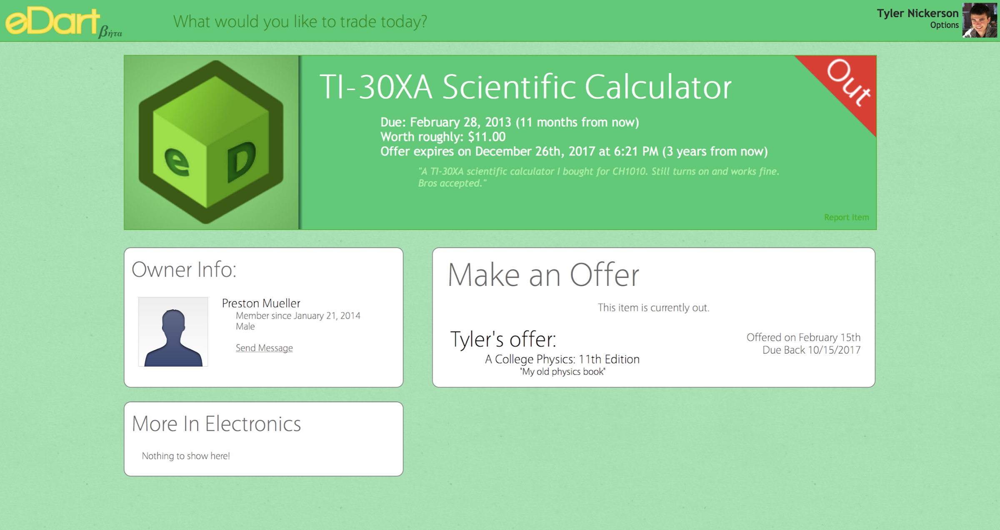

### Example

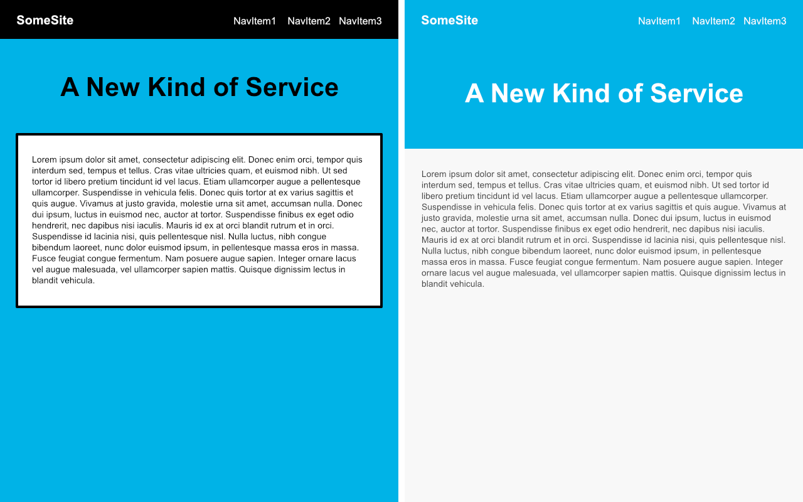

Using only these five simple rules, we can drastically transform this black-and-blue webpage into a much more aesthetically appealing site:

- The body of the site is light gray, reserving the blue brand color for the header only (rules 1 & 2)
- The header text is white, to complement the blue (rule 3)
- The text color was bumped up from black to a very dark gray (rule 4)
- The navbar’s background is transparent, so the bordering black and blue do not contrast with one another (rule 5)

### Resources

- [Flat UI Colors](https://flatuicolors.com/)
- [Flat UI Color Picker](http://www.flatuicolorpicker.com/)
- [Adobe Color](http://color.adobe.com/)
- [Coolors](https://coolors.co/)

## Light

While color serves many purposes, it can also be used to imply light through the use of gradients. In semiskeu, this practice is incredibly common. Let’s take another look at the Stripe homepage.

Where do you think the light source is?

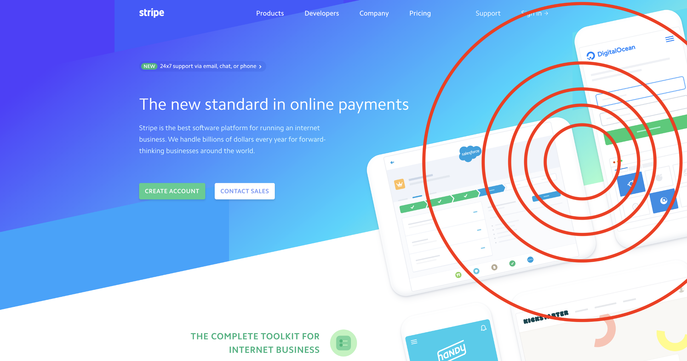

Here’s a hint: Stripe uses a radial light source. The light appears directly above the elements, which explains the low offset of the drop-shadow and the concentrated light green in the background gradient.

### General rules of thumb:

1. **Ensure consistency across all components.** Once you’ve defined a light source for your page, ensure that all shadows follow its direction. If light is “hitting” your page at 135 degrees, then every shadow and gradient should fall at 135 degrees.
2. **Use shadows as a tool to present hierarchy or state.** Shadows should be used to either highlight page components, provide page structure, or depict state. For example, you can depict a button is pressed by lowering its elevation as opposed to changing its color. Too many shadows can present too much dimensionality, so be careful (e.g. don’t create a site with 18 unique elevations).
3. **Your shadow’s offset should equal roughly half of its blur radius.** For example, a shadow with an x / y offset of 10px should have a blur radius of roughly 20px. This approach renders the most authentic shadow.
4. **Always keep the opacity of shadows to under 25%.** Err on the side of subtlety so not to detract from your design. If you are using a dark background, in some cases you may need to bump up the opacity of your shadow in order to ensure its visibility.
5. **Shadows don’t always need to be black.** When using shadows on colored surfaces, it is often advantageous to use a very dark or dulled variant of the background color to improve the shadow’s blend.

### Example

Now let’s put these rules to use. Here we add dimension to two sets of flat name cards. The primary cards utilize a monotone gradient to imply and illustrate light, while the accented cards use complementary colors to add an accent to the card’s heading:

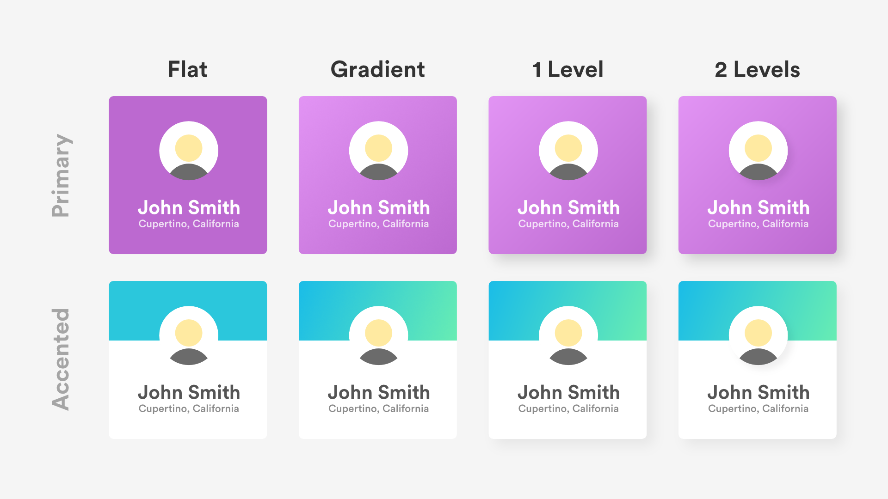

How do they use our rules of thumb?

- All shadows have an angle of 135 degrees. The gradient on the top row matches this angle to create light (rule 1).
- The shadows present a clear hierarchy of elements. The user’s avatar is tops the stack, as it is the most significant element (rule 2). Generally speaking, users will notice the topmost element first. In this case, the user’s attention will be shifted from the avatar, to the card (name and location), to the remainder of the page content.
- The offset on each card is roughly 20px, while the blur is set to 40px (rule 3).
- Every shadow has an opacity of less than 15% (rule 4).
- The shadow on the primary card’s avatar is #30163E, not #000 (rule 5).

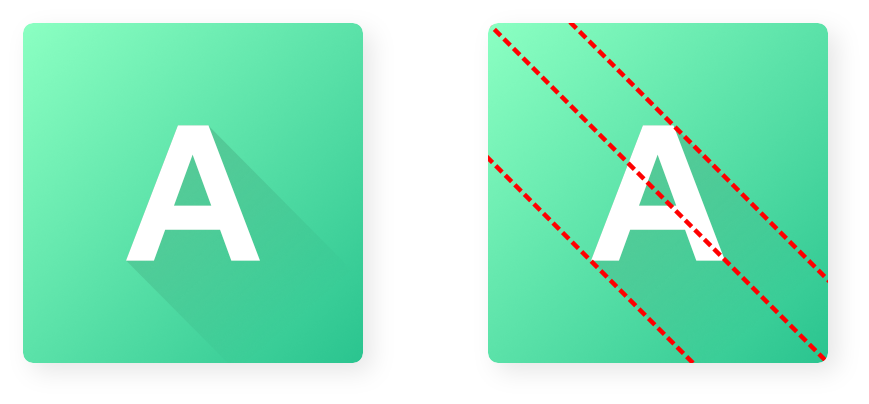

### Resources

- [CSSGradient](https://cssgradient.io/gradient-backgrounds/?ref=producthunt)
- [Gradient Hunt](https://gradienthunt.com/)
- [Web Gradients](https://webgradients.com/)
- [Elevation Hierarchy Guidelines](https://material.io/design/environment/elevation.html#depicting-elevation)

## Typography

You may have found yourself digging the font used in the above cards. This font is called Circular, and it is one of the most common fonts used by companies today. In fact, it’s the official font of both Spotify and Airbnb:

  
  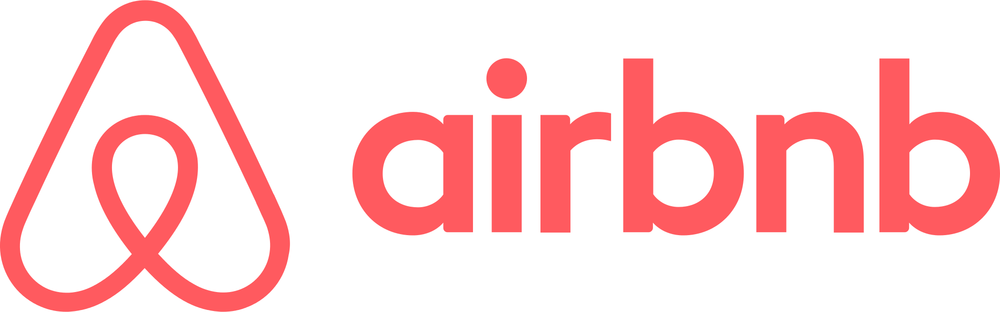

The Circular font stems from a [sans-serif](https://en.wikipedia.org/wiki/Sans-serif) font family called geometric sans. Geo-sans features clean geometric shapes and offers modernist flair, making it one of the most popular font families among modern designers. You can never go wrong using a geo-sans font on your webpage. Among the most popular are:

- [Open Sans](https://fonts.google.com/specimen/Open+Sans), [Lato](https://fonts.google.com/specimen/Lato), and [Montserrat](https://fonts.google.com/specimen/Montserrat) (free)
- [Museo Sans](https://typekit.com/fonts/museo-sans), [Proxima Nova](https://typekit.com/fonts/proxima-nova), and [Myriad](https://typekit.com/fonts/myriad) (starting at $60 / year)
- [Circular](https://lineto.com/The+Fonts/Font+Categories/Text+Fonts/Circular/), [Avenir Next](https://www.fonts.com/font/linotype/avenir-next), and [Gotham](https://www.typography.com/fonts/gotham/overview/) (pricey)

### General Rules of Thumb

- **Never use more than two typefaces.** The majority of webpages stick to a single typeface, however, occasionally you will see different typefaces used to denote between headers and body text. Take Medium for example. You’ll notice the menu of this page, as well as every header, is a sans-serif font, while the body remains serif.
- **Reserve stylistic fonts for logo use only.** This rule is kind of broad, as there are always edge cases, but in general you should stick to using stylistic fonts (any kind of curly, curvy, or novelty font) for logos only. Take Linguistic for example, which uses Lily Script One for its logo but uses Lato / Proxima Nova in for all other text.
- **Maintain a consistent type hierarchy.** You should only ever be using a handful of font sizes and one or two font weights to develop type hierarchy. Think of the HTML header tags h1, h2, h3, etc. You should have distinct visual styles for at least four of them, using variations in brightness, size, and weight to denote the importance of text. For a terrific example of type hierarchy, check out [Apple’s Human Interface Guidelines](https://developer.apple.com/design/human-interface-guidelines/ios/visual-design/typography).
- **Keep your body text a normal weight and well-spaced.** Text should always be legible, so reserve light or bold fonts for large headers or cases in which the font weight will have little impact on the legibility of text. Additionally, always keep the line spacing of your body text at 1.15 to 1.5 (depending on size) to maximize legibility. For example, this article has roughly a 1.5 rem line spacing. Justifying your body paragraphs doesn’t hurt, either.

### Example

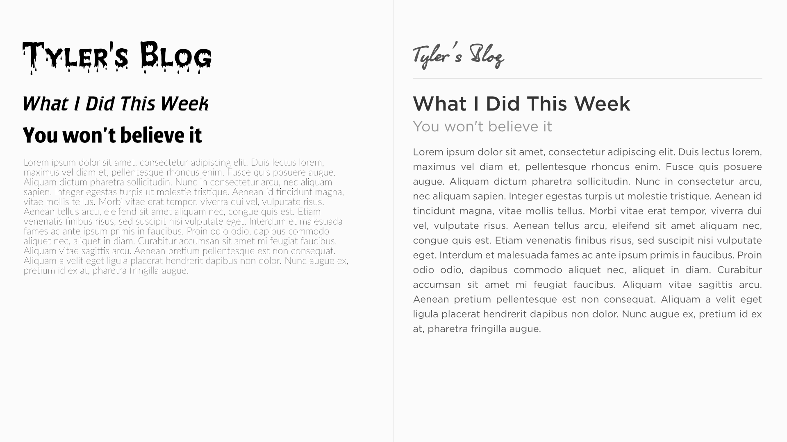

Using these four rules, we can convert the above mess of text into a structured article:

1. Number of typefaces is knocked down from four to two: OlgaC (logo) and Gotham (body) (rule 1).
2. Logo uses the only novelty font on the page (rule 2).
3. Clear, well-defined styles illustrate the article’s header, sub-header, and body content. These are implied by font size, opacity, and weight (rule 3).
4. Shrunk logo significantly to maintain the brand while avoiding the implication that the logo is the most significant element on the page (rule 3).
5. Body text has a font spacing of 1.5 and left justification (rule 4).

There are additional considerations when choosing fonts as well, like not using a Microsoft Windows font from 1996 [like I did](https://www.fonts.com/font/monotype/creepy).

### Resources

- [Google Fonts](https://fonts.google.com)
- [FontSquirrel](https://www.fontsquirrel.com/)
- [TypeKit](https://typekit.com/)
- [LostType](http://www.losttype.com/)
- [The League of Movable Type](https://www.theleagueofmoveabletype.com/)
- [Identifont](http://www.identifont.com/)
- [WhatTheFont](https://www.myfonts.com/WhatTheFont/)

## What’s Next

Hopefully this guide has given a bit of insight as to the direction you should pursue when designing and implementing your frontend platforms in 2018. There’s so much more to talk about, but I promised myself I wouldn’t write a book here. Feel free to follow my [personal blog](https://tylernickerson.com/blog) for more design and frontend-related topics or check out the [guidelines I’m developing](https://github.com/Nickersoft/design) in order to put all these design rules on paper.

Happy designing and developing!