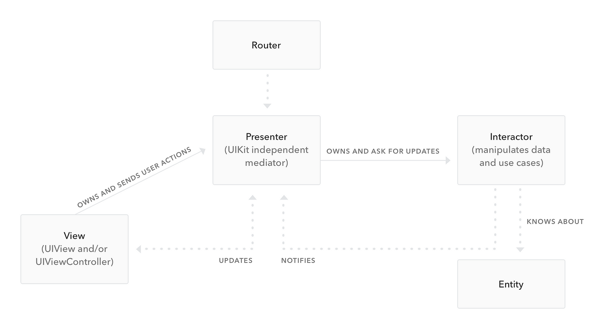
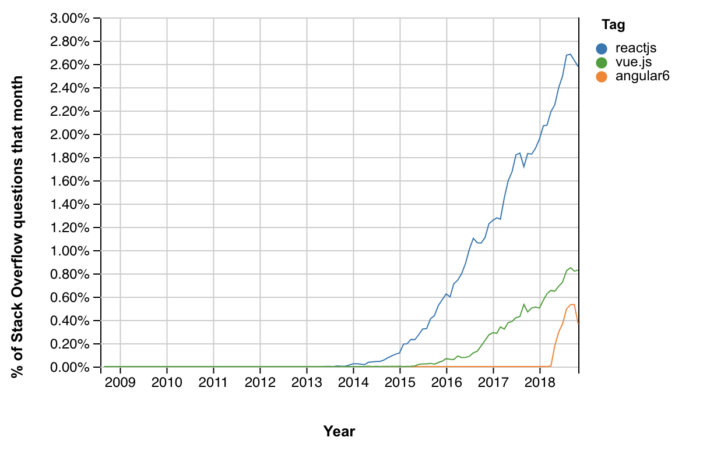

In 2014, I began my first internship. It was my first time working professionally in my field, and being a novice with virtually no industry experience, I was hired by the smallest startup imaginable. I sat alongside the two founders inside of a tiny garage, working on a codebase written in VBScript and ASP.NET. To this day, my work there continues to be the first and only time I've encountered Visual Basic in a professional environment.

I remember being immediately off-put by the company's choice to build a brand new product using decade-old technology, so I asked the co-founder about his decision to use VBScript.

His response?

> It was what I knew best at the time.

Words I've since heard far too often. Founders build with what they know best, often leading to poor system design, outdated tech, and infrastructure that cannot scale. Once the product takes off, constant shifts in prioritization eventually lead to insurmountable tech debt.

The result is always one of two outcomes: tech debt is left as-is or chunks of time are carved out to rebuild core infrastructure instead of shipping product.

Much of this dilemma is rooted in the ideology that any [minimum viable product (MVP)](https://blog.logrocket.com/product-management/what-is-minimum-viable-product-mvp-how-to-define/) should be quick, dirty, and cheap. In the words of [Michael Seibel, Y-Combinator partner](https://www.youtube.com/watch?v=fn5QxET8Y8c):

> If it takes more than a month to build, it's not an MVP.

While Seibel's advice is well-founded (I actually encourage watching the whole video), the "one-month" mentality has the potential to trick entrepreneurs into believing they must sacrifice their values for the sake of producing deliverables. A month *can* be more than enough for most MVPs  ---  given that you build it right.

In an ideal world, all MVPs would be planned and executed in the smartest, fastest way possible that doesn't compromise vision, design, or usability. Unfortunately, this is rarely the case. Some of my first projects were written using Visual Basic, PHP, and vanilla JavaScript, and went through multiple rewrites until they were deemed remotely usable or maintainable.

I found there always comes an "oh f***" moment, in which you realize your tech stack is not structured well enough to deliver features at the speed you need and you realize an impending rewrite is inevitable. For me, this moment has resulted in the death of far too many side projects over the years.

## Why does this matter?

As mentioned in my [previous article](https://blog.logrocket.com/designing-as-a-developer-in-2018-eca1ab5bff2), first impressions are everything. While that article discussed the importance of a product's visual design, the actual usability of a product is equally as important.

When I began work on a recent mobile app of mine, I chose [React Native](https://facebook.github.io/react-native/) as the springboard for its development. I believed that using a framework that allows developers to build for two platforms at once would allow me to spit out the fastest app I could. Yet a year or so into development, despite being feature complete, the app was riddled with bugs and performance issues. The behavior between platforms was inconsistent --- what might be a delight for iOS users could be hell for Android users, and vice versa.

While I was able to build something that would allow me to deliver an app to the most amount of people possible, it was a product that was painful to use and maintain. It didn't put users first. If users install software for the first time and it's incredibly buggy, they will likely never return to it. Most importantly, they won't take the product seriously.

You can build a product fast or you can build it right. If you build it right, then every future iteration of your software will be fast. If you build it fast, you get to ship product but risk the potential of an unnecessary code rewrite in the future.

So, how do you do it?

## Realize the requirements

Before diving headfirst into a product, consider what your requirements will be ahead of time and allow them to influence your design decisions. Can the entirety of your app run as a single Node.js application? Will it need to make calls to external APIs? Does your app rely on data from the cloud or is local storage sufficient? While these questions may seem trivial, they will help guide you through the remaining steps and help you build better software.

### Example

Let's start with a basic MVP idea: a Reddit-like website where you upvote and downvote pictures of people's pets. At the end of every week, the most upvoted pet is selected and featured on the homepage the following week. Let's called it PetParty.

What you could do: Rent a VPS. Set up a basic database, API layer, and directory structure that allows you to do basic POST file uploads to store user images locally and reference them in the database.

What you should do: [Dockerize](https://docker-curriculum.com/) it. Run your database and API in separate docker containers, and [place them in the same network](https://docs.docker.com/network/). Store your files using an external service, like [AWS S3](https://aws.amazon.com/s3/) (maybe even with [Cloudfront](https://aws.amazon.com/cloudfront/)).

Why: Suddenly your website explodes. People are uploading hundreds of pics a day (why wouldn't they, animals are adorable). You max out your space on your VPS. Your experience the [Slashdot effect](https://en.wikipedia.org/wiki/Slashdot_effect). You want to make the system distributed, but you can't without Dockerizing everything and reconfiguring your server. You've hit your "oh f***" moment almost immediately after launch.

## Adopt an architecture

Though varying in degrees of applicability, software architectures allow you to build code with structure and integrity. They stop you from asking questions such as "where should I put this logic?" and improve codebase navigation. While the most popular architecture is Modal-View-Controller [MVC](https://en.wikipedia.org/wiki/Model%E2%80%93view%E2%80%93controller), there are many others as well, such as [MVVM](https://en.wikipedia.org/wiki/Model%E2%80%93view%E2%80%93viewmodel), [MVP](https://en.wikipedia.org/wiki/Model%E2%80%93view%E2%80%93presenter), [VIP](https://hackernoon.com/introducing-clean-swift-architecture-vip-770a639ad7bf?gi=161549ad2d6a), [VIPER](https://www.objc.io/issues/13-architecture/viper/).

Whichever architecture you choose very much depends on the needs of your software. Furthermore, certain frameworks may use their own architectures or app structures, such as [Angular](https://angular.io/) (NgModules) or [React](https://reactjs.org/) ([Flux](https://medium.com/@cabot_solutions/flux-the-react-js-application-architecture-a-comprehensive-study-fd2585d06483) / [Redux](https://redux.js.org/)).

### Example

Let's go back to PetParty. You've decided to roll out a new feature: image editing. Now you can add funny little hats and mustaches to everyone's pet pic. The image editor opens in a new modal.

What you could do: You add an onClick event to a button that displays the image modal DOM element. You use HTML canvas to edit the image, then use another onClick event trigger to close the modal and upload the new image.

What you should do: Utilize a frontend library like React and the [Flux](https://medium.com/@cabot_solutions/flux-the-react-js-application-architecture-a-comprehensive-study-fd2585d06483) architecture and trigger the modal's visibility by dispatching a Flux action. The action will accept an image, which will be editable in the displayed modal. The modal would then dispatch a "close" action the calling page would subscribe to, containing the edited image URL.

Why: If the logic from the first suggestion was used, where would it live? On every page that calls the modal? Where would the active image URL live? As a local variable? This approach limits the reusability of the modal, making it harder to call and reuse. By implementing a unidirectional architecture, these kinds of questions are easily answered.

## Ready for the ramp-up

While building an initial product, it is crucial that your approach allows you to develop new features as quickly as possible. For example, the static site generator [Gatsby](https://www.gatsbyjs.org/) will automatically compile a directory of ".jsx" files to unique page routes out-of-the-box. Need a new page for user profiles? Bam. Just add a single React component and leave the routing up to [Gatsby](https://www.gatsbyjs.org/).

*That's what I'm talking about.*

Other situations may require more work. The good news is, if you've already adopted an architecture, you're already halfway there. In the case of my recent mobile app, I used [VIPER](https://www.objc.io/issues/13-architecture/viper/) + [custom XCode templates](https://robots.thoughtbot.com/creating-custom-xcode-templates) to rapidly add new screens as I developed it.

For web apps, check out [Yeoman](https://yeoman.io/).

### Example

You want to add a page to the newly viral PetParty website that features pet "all-stars" --- the cutest, most popular animals from the past year. You'll need to add a new API endpoint, a new page, and a new route to serve the page.

What you could do: Exactly what was mentioned. Manually write the logic for a new route, the view and logic for the new page, and add a new API endpoint. It may take you two or three days.

What you should do: Generate your routes dynamically via a framework like Gatsby. You add a single React component to a directory and *bam*! You've covered 2/3 steps already. You could even structure your API in a similar manner, in which a module exports two things: the route name, and the routing logic. Express adds it to the app automatically.

Why: This approach saves you the time it would take to scaffold a new feature by hand. While it may take a bit longer to set up the automation pipeline, once it's in place you can launch new pages and campaigns with the drop of a hat.

## Reduce, reuse, recycle

If you ask any web developer nowadays how they might approach a new project, most will say they'd use component libraries such as [Angular](https://angular.io/), [React](https://reactjs.org/), and [Vue](https://vuejs.org/). Their reasoning is simple: modularity. By breaking a web app into modular, reusable components, [code duplication](https://en.wikipedia.org/wiki/Don%27t_repeat_yourself) is greatly minimized and site-wide changes can occur in a central module that propagates throughout the app. This approach makes your code easier to maintain, easier to test, and easier to extend your code in the long term.

The idea of modularity in web apps has, in fact, become so popular that the concept has bled into other areas of the tech realm as well, such as [iOS](https://componentkit.org/) and [Android](https://fblitho.com/) development.

For a brief overview of modular programming, I suggest [checking out Wikipedia](https://en.wikipedia.org/wiki/Modular_programming). For a more in-depth look at modularity regarding your specific tech stack, I would do some additional research before beginning.

### Example

PetParty has now gathered enough attention that you want to hire some part-time help. After trying out the advice mentioned in [my last article](https://blog.logrocket.com/designing-as-a-developer-in-2018-eca1ab5bff2), you decide you still want to hire a designer. The designer comes up with a full-fledged design system for your site, which features two styles of buttons: primary and secondary. One is blue, one is gray.

What you could do: Easy. Create two global CSS classes. Apply them as needed.

What you should do: Create a reusable React, Vue, or Angular component that scopes these styles to the component. Allow for a "theme" prop, that can either be "primary" or "secondary". [Don't allow the component to accept a "className" or "styles" prop](http://jxnblk.com/writing/posts/patterns-for-style-composition-in-react/#stateless-functional-ui-components).

Why: While CSS classes are great, they'll allow developers to override and extend the styles of your buttons, breaking the design system. Furthermore, any JS business logic for your button can be attached to the button itself, without having to duplicate logic across any page that simply uses the button.

## Embrace the ecosystem

Lastly, when deciding on an architecture or framework to achieve any of the above goals, ensure whatever you choose has good documentation, a good community, and (preferably) good maintenance. This step is particularly tricky considering how rapidly new frameworks come and go. It is usually fairly safe to bet on tech stacks that are at this point "too big to fail", such as [Node](https://nodejs.org/) (8+ years old), [.NET](https://dotnet.microsoft.com/) (15+ years old), [Cocoa](https://en.wikipedia.org/wiki/Cocoa_Touch) (10+ years old), or [Java](https://en.wikipedia.org/wiki/Java_%28software_platform%29) (20+ years old).

Frameworks such as [React](https://reactjs.org/) and [Angular](https://angular.io/) are fairly new to the game, having only been around for less than 10 years, so only time will tell. What is important is that you and your developers will be able to always find the resources you need to continue building your product well into the future. A decent indicator of a framework's support may be [how many StackOverflow questions exist for it](https://insights.stackoverflow.com/trends), its [GitHub star count](https://github.com/trending), and [its GitHub contributor activity](https://help.github.com/articles/viewing-contribution-activity-in-a-repository/).

It's important to note an exception to the rule: sometimes you have no choice. Take for example [Apollo's iOS library](https://github.com/apollographql/apollo-ios): it is poorly maintained, poorly documented, but still remains one of the most popular (if not only) solutions for using GraphQL on iOS (unless you want to write your own framework).

### Example

You decided to listen to some of the above advice and use a unidirectional architecture for PetParty.

What you could do: You decide to forego Flux and Redux and use a great new library you discovered called StatefulJS. It claims to function just like Redux and Flux but is lighter and more flexible.

What you should do: Use Flux or Redux, despite the potentially heavier load.

Why: StatefulJS only has 96 GitHub stars. It was built by a guy named Devin from Ukraine and last updated nine months ago. No one online is talking about it. It has a handful of README files in the repo, but other than that no documentation. Unsurprisingly, no one on your team can figure out what to do when you hit your first bug using it. Devin is unresponsive. You've now held up development by spending time debugging a library no one uses.

## Conclusion

Now before you raise your pitchforks and claim that much of this may be overkill for a simple MVP, realize that these are simply considerations for when you're building your next big product. You don't have to use a heavy framework like [React](https://reactjs.org/) or a complex architecture like [VIPER](https://www.objc.io/issues/13-architecture/viper/) if you think it's too much. I just ask that you consider the design and infrastructure of your system before you begin tossing it together with the first tool that comes to mind. If your goal is to use your MVP to validate your idea, be sure to tell people about your idea while developing it.

Many devs don't realize the importance of planning an MVP, and as one developer who has dealt with way too much tech debt in his life, I just ask that you all be smart before you start. 😎