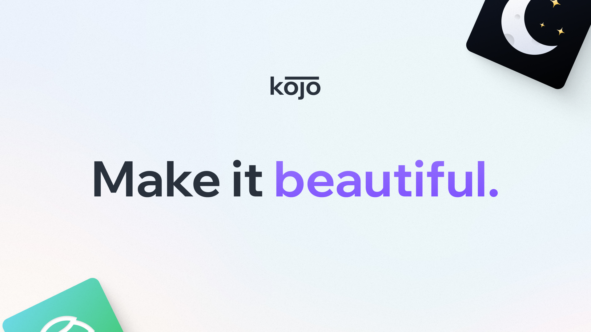

Folks, I know it has been a minute since I've published anything.

For months I had been crafting an extremely detailed post regarding how we hired our first engineers at Linguistic – a post I may still publish someday (there still aren't a ton of great resources around online for hiring your first engineers IMO).

A lot has happened in the past few months – I got married, moved to Washington, got my wife a green card, and was asked to resign from my own company. That's right – I no longer work at Linguistic. 

After a number of disagreements between my co-founder and me, she found it best we part ways. Those who know me will know that the Linguistic brand and codebase are something I began working on back in 2015, so naturally, walking away from it all after 8 years was challenging for me, to say the least.

However, this isn't the reason I wanted to write a post. I may write a retrospective at some point, but for now, I want to talk about what's next.

## Kojo Design

For years, I have placed design at the heart of everything I build. I love design. I would marry it if I could (and if I wasn't, you know, already married). 

If there's something I've learned, it's that in a startup environment, getting buy-in on design isn't always a guarantee. Making a user-friendly, "pretty" product is often an afterthought when shipping quickly, especially if the team is super technical. In fact, the disparity between engineers and design is the reason that libraries like [shadcn](https://ui.shadcn.com/), books like [Refactoring UI](https://www.refactoringui.com/), and even my [own post from 2018](http://localhost:4321/blog/designing-as-a-developer/) exist. 

In an attempt to address this problem, I'm launching [Kojo Design](https://kojo.design): a dev-friendly design subscription for startups. Unlike other design subscription agencies, Kojo specializes in working with technical startup teams to ship absolutely gorgeous and highly functional products. The name is taken from the Japanese word kōjō (向上), meaning to "improve".  

How Kojo works is simple: for a flat monthly fee, you gain access to a dedicated space in [Notion](https://notion.so) where you can manage projects, file design tickets, and request revisions. Each task will be tackled one or two at a time (depending on your tier) and delivered to you within a couple of days via a Figma link. Every design will feature a robust set of styles and components unique to you to make translation into code super easy.

The site is already up and shh... there's a secret sale going on right now if you want to jump on it before everyone else does ➡️ https://kojo.design.

## The Open Dictionary

For those who have been following me online, you may know that this past June I presented [The Open Dictionary Project](https://odict.org) at the [eLex lexicography conference](https://www.youtube.com/watch?v=HNpT4TBRqcM) in the Czech Republic. While ODict certainly warrants its own blog post at this point, here is a quick run-down:

[ODict](https://github.com/TheOpenDictionary/odict) is an open-source file format for lexical data that I developed in 2017 for use in Linguistic. While ODict has always been closely coupled with the needs of Linguistic, it's technically been its own entity as long as it has existed. It is licensed under the [GNU General Public License v3.0](https://github.com/TheOpenDictionary/odict/blob/main/LICENSE). 

I developed ODict to fill a very specific gap: the lack of a standardized, compiled format for storing and retrieving structured lexical data offline. I talk about this gap on the project's [homepage](https://www.odict.org/docs/introduction/motivation), as well as in the talk I linked above. Until now, the project has occasionally stirred interest from a handful of [GitHub patrons](https://github.com/TheOpenDictionary/odict/stargazers), though I'm hoping its future plans will inspire more interest.

Despite my current focus on getting Kojo off the ground, I'm still deeply committed to language learning, lexical data, and the mission both Linguistic and ODict set forth. My hope (but not promise) is that over the next several months, I will be able to build an online portal for ODict that acts as a home for structured, lexical data. 

Currently, the two biggest resources for free, bilingual data online are [Wiktionary](https://wiktionary.org/), which stores its data as wikitext markup, and [Glosbe](https://glosbe.com/), a shockingly robust yet under-maintained website with no public API. My goal with ODict is to establish a new open, online dictionary that anyone can contribute to. All data will be perpetually available as an API or as an ODict binary and, of course, the entire platform would be open-source. The initial platform would be seeded with data from Wiktionary and elsewhere, much like Glosbe is.

ODict could then extend beyond the web portal to offer official SDKs and maybe even a mobile application. The mission would be to create a universal resource for bilingual language data that puts researchers and developers first.

Today, ODict development is still continuing, with the latest release featuring an official [XSD specification](https://github.com/TheOpenDictionary/odict/blob/main/odict.xsd) for the ODXML format. 

## Closing

While the past few months have certainly been turbulent, I'm still very much looking forward to the future. Whether or not Kojo, ODict, or anything else I choose to work on succeeds or fails is still very much up in the air, but there's still a certain excitement to not knowing. 

As my dad used to say, "hope for the best and expect the worst."

