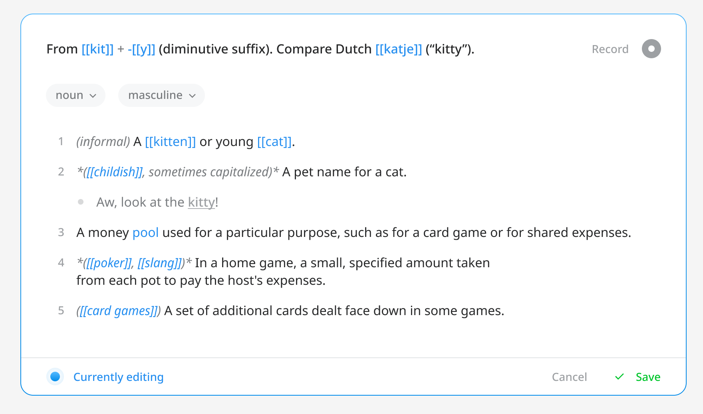

import Callout from '@components/Callout.astro';

**[ODict](https://odict.org)**, short for **The Open Dictionary** is a personal project of mine that began as a file format for storing structured lexical data (etymologies, word senses, definitions, etc.). My work on the file format was presented at the [eLex](https://elex.link) lexicography conference in Brno, Czechia in 2023 (you can watch the talk [here](https://www.youtube.com/watch?v=HNpT4TBRqcM)!).

I recently began an exploration of what a potential web platform based on the format might look like, as an alternative to existing sites like [Wiktionary](https://wiktionary.org) and [Globse](https://glosbe.com/). 

## The Problem: There is no open platform for structured lexical data

Lexical (or language) data is extremely useful, as it can be used to train NLP systems and ML models, compile dictionaries, accelerate research, and teach foreign languages. 

Unfortunately, most websites that provide such data fall into two camps:

<Callout title="Online wikis" emoji="1️⃣">
	- Websites like Wiktionary, OmegaWiki[^1], and Wikidata
	- Data is freely available, but either loosely structured or fully unstructured (i.e. data exists solely as blocks of wiki text)
	- Data querying, if any, is typically done using [SPARQL](https://en.wikipedia.org/wiki/SPARQL), which isn't approachable to most people
</Callout>

[^1]: Defunct as of 2022

<Callout title="Sites with either paid or private data" emoji="2️⃣">
	- Websites like Linguee, Globse, Merriam-Webster, and others
	- Accessing the data via a web portal is free, but the data is not crowdsourced and there is no free API to access the data
</Callout>

## The Goal: Create an easy-to-use, crowdsourced platform for structured lexical data

I began by outlining the primary user goals of the project:

<Callout color="blue" title="Viewing" emoji="👀">
	- Quickly search for the words they’re looking for in the language they’re learning
	- Quickly switch between languages (dictionaries)
	- View comprehensive, easy-to-read definitions with full examples, audio, etc.
</Callout>

<Callout color="yellow" title="Authoring" emoji="✍️">
	- Easily edit the page without knowing any special markup, while still maintaining the definition structure
	- Easily record audio for the page
</Callout>

<Callout color="green" title="Developing" emoji="🧑‍💻">
	- Download dictionary dumps as compiled .odict as well as XML  
	- Access data via an API
</Callout>

I was especially interested in how I would approach authoring, as finding a way to represent complex lexical data in a user-friendly way sounded challenging.

## Competitive Analysis

As with most projects, I began by collecting screenshots of the most popular online dictionaries to understand their general IA and user experience. 

The sites I looked at were: 

- [Wiktionary](https://wiktionary.org)
- [Naver](https://en.dict.naver.com/#/main?sLn=en)
- [Linguee](https://www.linguee.com/)
- [Dictionary.com](https://dictionary.com)
- [Oxford Learner Dictionary](https://www.oxfordlearnersdictionaries.com/us/)
- [Lexico](https://en.wikipedia.org/wiki/Lexico) (now defunct)
- [Merriam-Webster](https://www.merriam-webster.com/) 
- [Jisho](https://jisho.org/)
- [Glosbe](https://globse.com/)

Across the board, I found most sites to be cluttered and filled with either auxillary information or ads. While the manner in which definitions were presented was pretty standard, surrounding UI detracted from the main user experience. 

The most simplistic experiences were Oxford and Jisho, as their sites prioritize only showing you directly useful information when looking up definitions.

## Explorations

### Homepage

In a similar vein to how [Google beat Yahoo with simplicity](https://blog.codinghorror.com/in-pursuit-of-simplicity/), I felt that ODict should be as _simple as humanly possible_ if I wanted it to stand out.

You should come to the site, specify a language, and search for a word.

My original exploration operated under the assumption the site would function similar to how Wiktionary works – something like `en.odict.org` or `fr.odict.org`, with all definitions being in English or French, respectively. You would only specify the language of the word you are looking up. 

I eventually abandoned this approach, as I felt it would be more intuitive for users to specify a base and target language right from the main domain:

<figure>

<figcaption>The final homepage</figcaption>
</figure>

### Definitions

As anticipated – I struggled with definition pages. 

In my pursuit of extreme simplicity, I ended up with a page that felt super barren:

After growing discontent with the direction, I stopped wireframing halfway through and took a step back.

I thought to myself:

> ODict already has a console UI for viewing definitions. How can I translate that?

The console UI I had built for ODict was very minimalistic and represented the data in a clean way:

The biggest drawback to the console UI is that for words containing multiple etymologies (word origins), they are all printed on top of one another, making it difficult to sift through the pile of data.

I decided to explore a card-based layout for the web UI, as this would provide a few benefits:

1. Clearer separation of etymologies and definitions of different origins.
2. By constraining the space in which definitions appear, white space is removed and the empty feeling created by my original design is reduced.
3. Each card can have its own authoring controls, avoiding the overwhelming experience of editing the entire page at once (like you would in a wiki). 

<figure>
  
  <figcaption>The formatting of the definitions follow that of the console UI.</figcaption>
</figure>

### Authoring

ODict, as a format, supports [Markdown](https://daringfireball.net/projects/markdown/) for definitions and descriptive text. 

My initial thought was that the authoring experience should be a simple Markdown editor with support for some wiki-styled syntax (i.e. having `[[double brackets]]` alias to other words found in the same dictionary). 

There was just one problem: ODict uses **structured** data. If definitions and examples are plain-text Markdown, there is **no way** from a technical standpoint to determine which bullets are meant to be definitions, examples, or definition groups.

I decided to opt for a block-based editing experience, similar to that found in [Notion](https://notion.so). The text itself would still support Markdown, but the definitions, examples, and groups would be blocks that could be added, deleted, and reordered via a three-dot menu.

### Examples 

While ODict supports inline examples as part of its file structure, I wanted to provide a way for users to view more extensive examples via a data source like [Tatoeba](https://tatoeba.org). 

As a long-time using of Pleco's mobile Chinese dictionary, I've always loved the simplicity of having separate tabs for definitions, strokes, examples, etc. 

I decided to adopt this approach in my design:

## Final Design

The best way to experience the final design by using its prototype.[^2]

[^2]: **Known issue:** the homepage and example pages show an English to Spanish dictionary, while definiton pages show an English to English monolingual dictionary.

Click below to view it and poke around ⬇️

import Button from '@components/Button.astro';

import Arrow from '~icons/mdi/arrow-right';

<Button title="Launch prototype" href="https://www.figma.com/proto/PgUHHdmZhn4EjEJ8zsCmAT/The-Open-Dictionary?page-id=4%3A358&type=design&node-id=1272-4560&viewport=532%2C14%2C0.28&t=tErjoihkdNJUxXCU-1&scaling=min-zoom&starting-point-node-id=1272%3A4560&mode=design" iconPlacement="after" icon={Arrow} />

## Next Steps

Given that ODict is an ongoing project, there is still quite a bit of the platform left to design. 

Notably:

- User profiles
- File download pages 
- User recordings
- Moderation features 

Fortunately, the most important (and previously ambigious) aspect of the platform – searching and viewing definitions – has already been tackled.