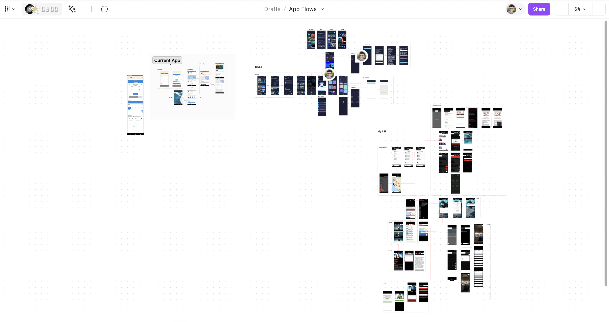
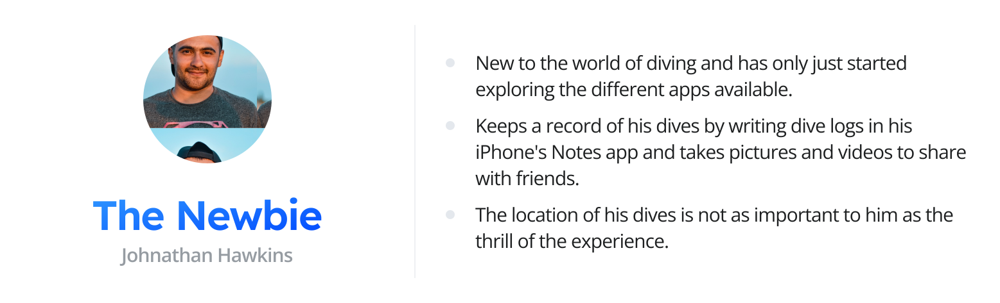
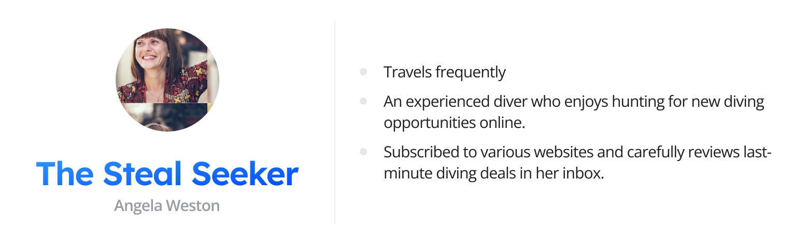
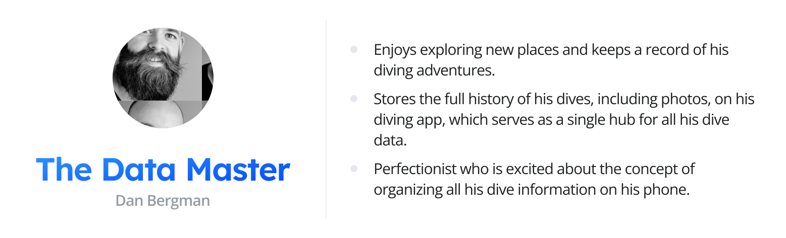
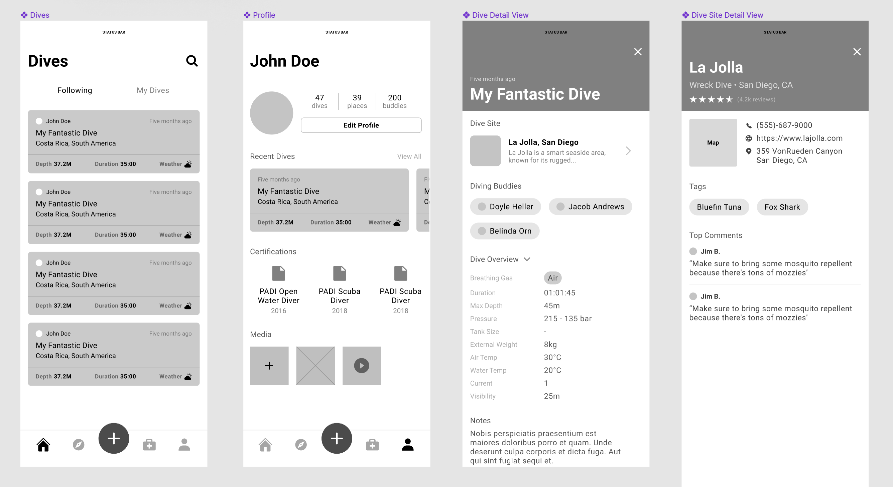
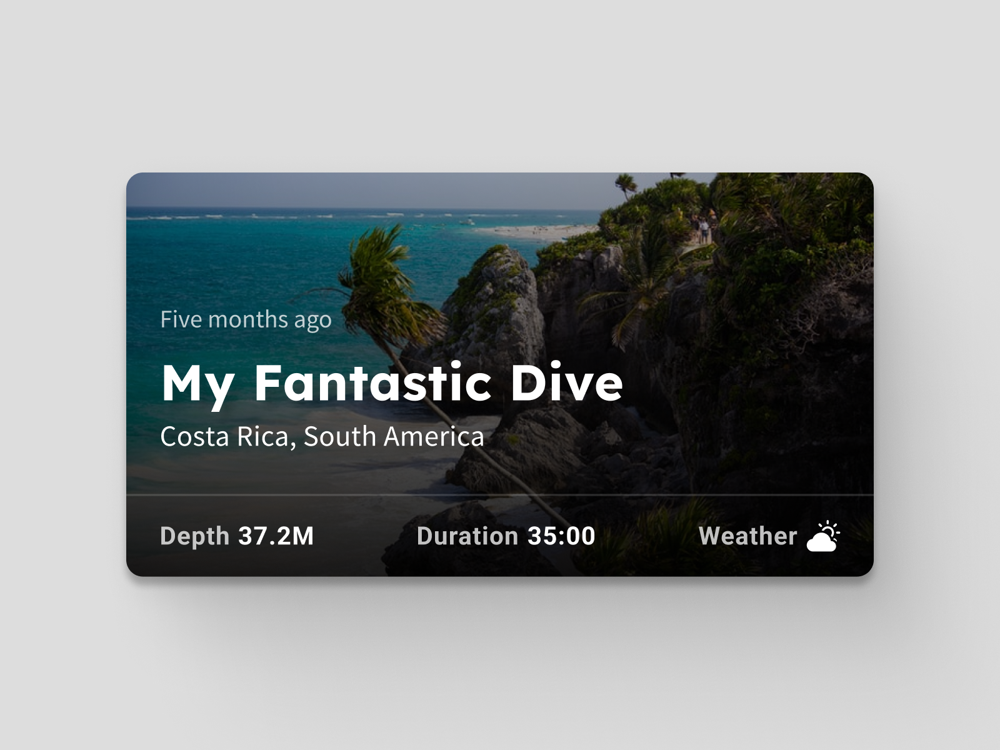

**Scubah** is a cross-platform mobile application that automates dive tracking for scuba divers while allowing you to connect with fellow divers and subscribe to their activities.

The two co-founders of the project are strictly technical, so I led all branding and product design efforts for their team.

## The Problem: Existing diving apps just don't cut it.

While there is a sea of diving apps on the market, the Scubah team found that even the most popular ones fall short of expectations. 

After doing some competitive analysis, the main trends I noticed were:
 
1. **Poor UI or UX**
	- Apps like [Subsurface](https://subsurface-divelog.org/) heavily prioritize features over aesthetics and basic usability. 
	- The tiny UI controls and messy UI makes it difficult to navigate.
2. **Too buggy or cluttered**
	- Apps such as [Dive+](https://play.google.com/store/apps/details?id=com.lifeplus.diveplus&hl=en_US&gl=US) contain so many features it can be overwhelming, as the navigation and IA between them could be greatly improved
	- Most of the recent reviews of Dive+ cite extensive app bugginess
3. **Too technical**
	- As many divers happen to be programmers, the majority of apps cater to a more tech-savvy audience.

## The Goal: Create an inclusive, all-in-one diving app for everyone

Through prior user interviews conducted by one of Scubah's founders, we determined that divers primarily turn to diving apps to solve three pain points:

1. **Sharing** 
	- Just like everybody else, divers want to be able to easily share their once-in-a-lifetime experiences with friends and families.
2. **Data Collection**
	- Divers want to be able to collect, organize, and browse their past dives in a central location. 
	- A main benefit is being able to view the equipment settings they've used on previous dives.
3. **Deals**
	- Diving is typically a very expensive endeavor, and there is no good way for divers to track travel discounts for different dive sites.

After reviewing the notes from these interviews, I aggregated the findings into three user personas: The Newbie, The Steal Seeker, and the Data Master.

##  Early Explorations

The primary aim during the exploration phase was to create an experience that was as **unobtrusive and intuitive as possible**, seeing there is no guarantee the end user can navigate a highly technical interface. 

Your homepage would be a simple feed of your dives and those of your fellow divers. At the bottom would be a tab bar with links to browse dive sites, add dives, view your emergency kit, and go to your profile.

## Final Design

The final designs consisted of four main screens: the main feed, the user profile, a dive detail view, and the dive entry screen (accessible from the + icon in the nav bar).

## Current Status

Other screens, such as the tab for browsing dive sites, were started but never completed. Unfortunately, an unexpected personal matter came up on their end, causing the development of the product to halt for several months.

Development has since resumed, and I sincerely hope to one day continue collaborating with the founders to make their app the best diving app on the market.
